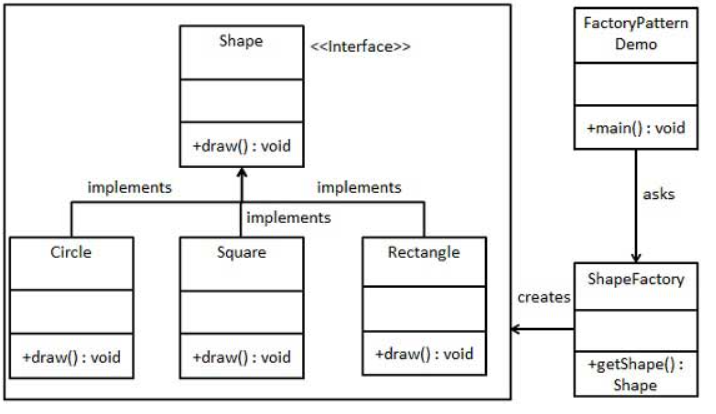

# SpringFrameworkCourse

Complete Spring course

## Some important/common Spring annotations

If we are working in the default project structure the default scan of classes and components needed to run our application is going tobe able of "see" all the resources to launch it, otherwise if we have a different project file tree or a external component we have to use the annotation below ,in our main class, to scan other packages:

```ruby
@ComponentScan(basePackages{"java.package.of.a.external.class","some.other.component"})
```

The "ComponentScan" annotation is not the best option in large applications so, we can achive the same ,scan externals components, through java configuration rather than the component annotation. What this configuration annotation does is point to spring where to look for configuration parameters, this configuration class is going to define different beans.

In the example below we removed the Service tag of our service classes and in our configuration class we create the beans that we are going to use to get these classes:

```ruby
    
package keep.learning.dependencyinjection.config;

@Configuration
public class MyApplicationCongig {

    @Bean
    ServiceClassExample1 serviceClassExample1() {

        return new PerviceClassExample1;
    }

    @Bean
    ServiceClassExample2 serviceClassExample2() {

        return new PerviceClassExample2;
    }
}

```

The next annotation ['@Primary'], is needed when we have more than one bean of the same type. When we have differents languages but we are using different beans of the same type. This annotation can be use in a class or in a method and, as we saw before, we can have this implementation in a configuration class the annotation would be the same in a class:

```ruby
    
package keep.learning.dependencyinjection.config;

@Configuration
public class MyApplicationCongig {

    //As we can not have the same name for a method in java we have to override the name of the method
    // and give to the bean a specific name @Bean("primaryService")
    @Profile("ES")
    @Bean("primaryService")
    PrimarySpanishService primarySpanishService() {

        return new PrimarySpanishService();
    }

    @Profile({"EN","default"})
    @Bean
    PrimaryEnglishService primaryService() {

        return new PrimaryEnglishService();
    }

    @Primary
    @Bean
    PrimaryBaseService primaryBaseService() {

        return new PrimaryBaseService();
    }
}

```

## Using Factory pattern

Factory pattern is one of the most used design patterns in Java. This type of design pattern comes under creational pattern as this pattern provides one of the best ways to create an object.

In Factory pattern, we create object without exposing the creation logic to the client and refer to newly created object using a common interface.



### First we need an interface

```ruby
public interface Shape {
   void draw();
}

```

### Second we need our classes implementing the interface before

```ruby
public class Square implements Shape {

   @Override
   public void draw() {
      System.out.println("Inside Square::draw() method.");
   }
}

```

```ruby
public class Circle implements Shape {

   @Override
   public void draw() {
      System.out.println("Inside Circle::draw() method.");
   }
}

```

### Third we need the factory class, the one which is going to have the different implementation of our objects

```ruby

public class ShapeFactory {
	
   public Shape getShape(String shapeType){

      if(shapeType){
        case "circle":
            return new Circle();

        case "square":
            return new Square();

        default:
            return new Circle();
      }
   }
}

```
### Now we just have to make the proper call to our factory

```ruby


   public static void main(String[] args) {
      ShapeFactory shapeFactory = new ShapeFactory();

      //get an object of Circle and call its draw method.
      Shape shape1 = shapeFactory.getShape("CIRCLE");

      //call draw method of Circle
      shape1.draw();

      //get an object of Rectangle and call its draw method.
      Shape shape2 = shapeFactory.getShape("RECTANGLE");

      //call draw method of Rectangle
      shape2.draw();

      //get an object of Square and call its draw method.
      Shape shape3 = shapeFactory.getShape("SQUARE");

      //call draw method of square
      shape3.draw();
   }
}

```